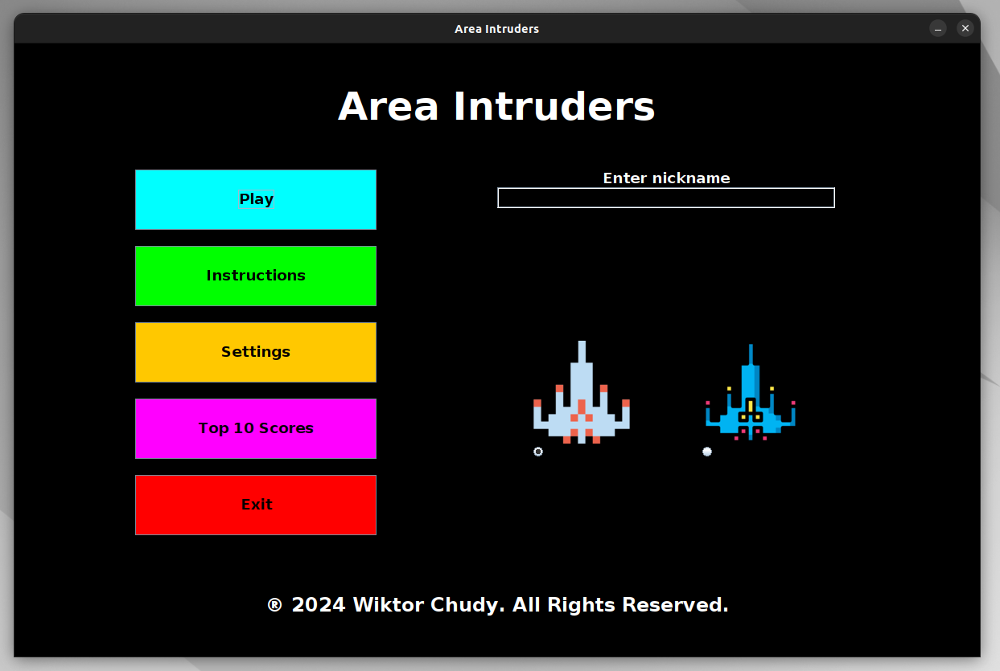
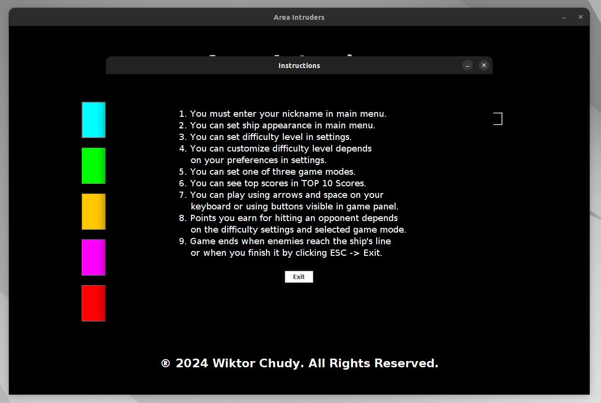
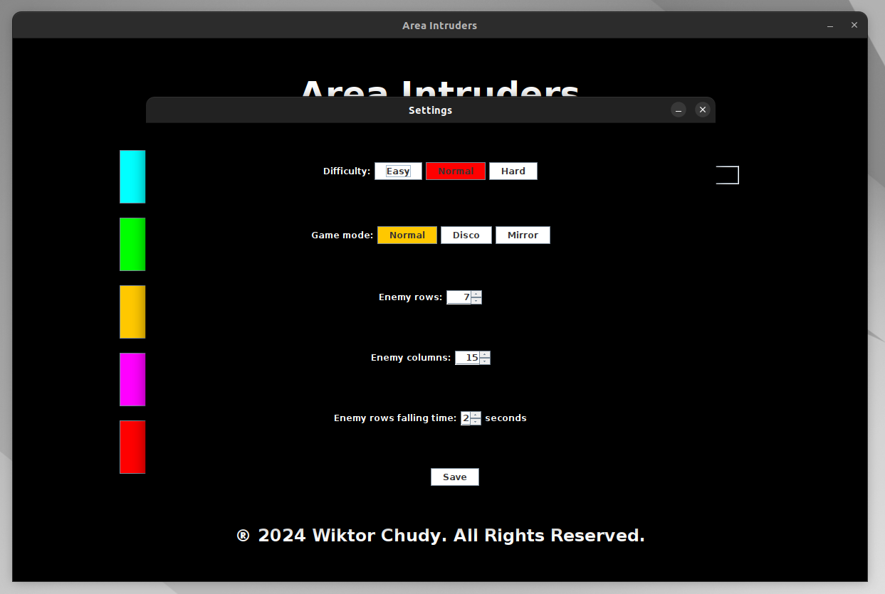
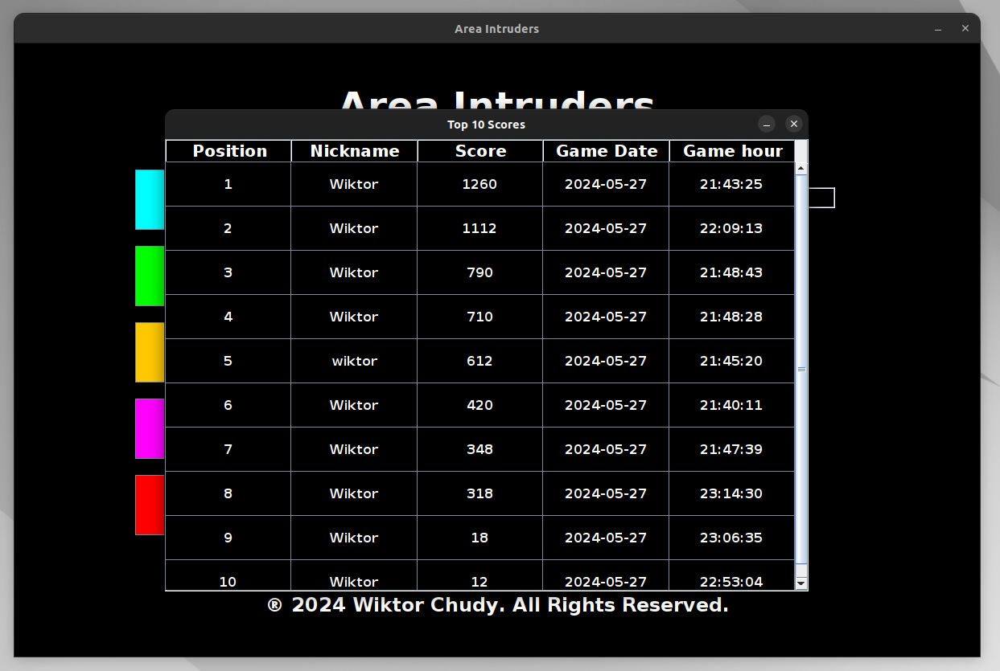
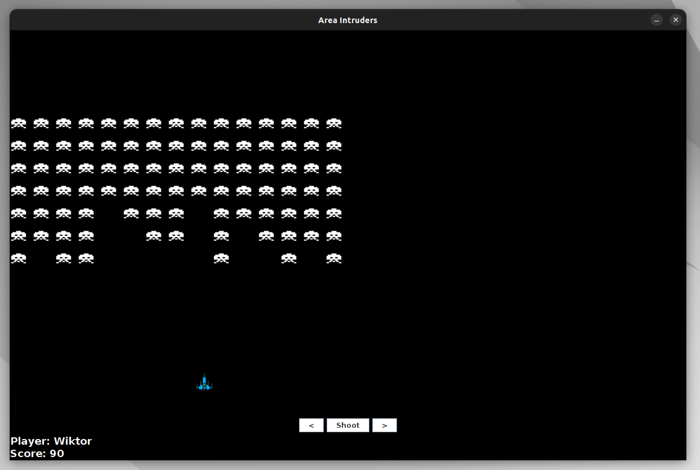
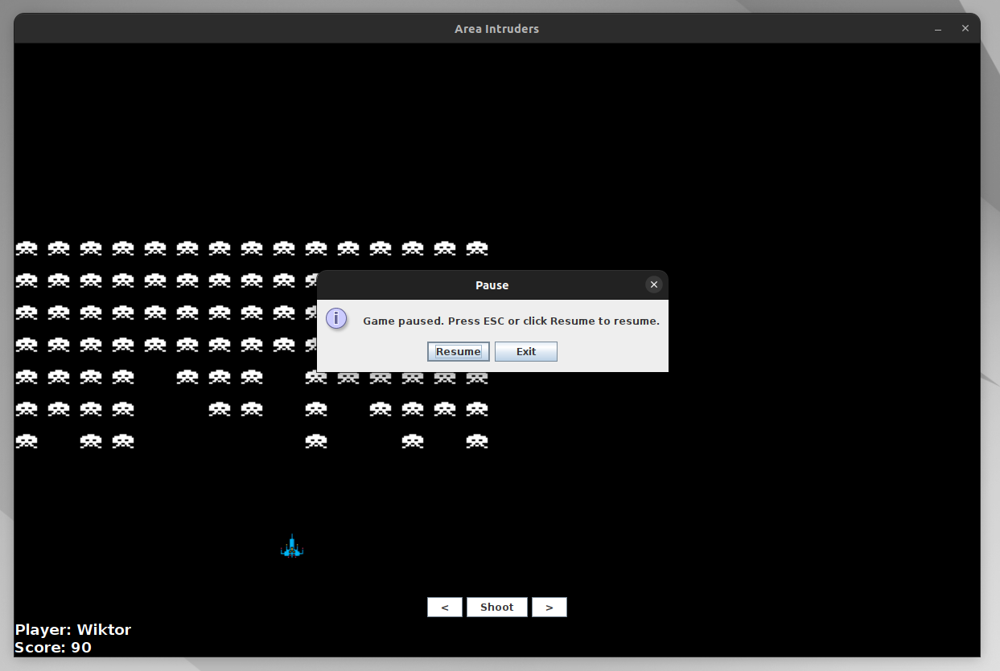
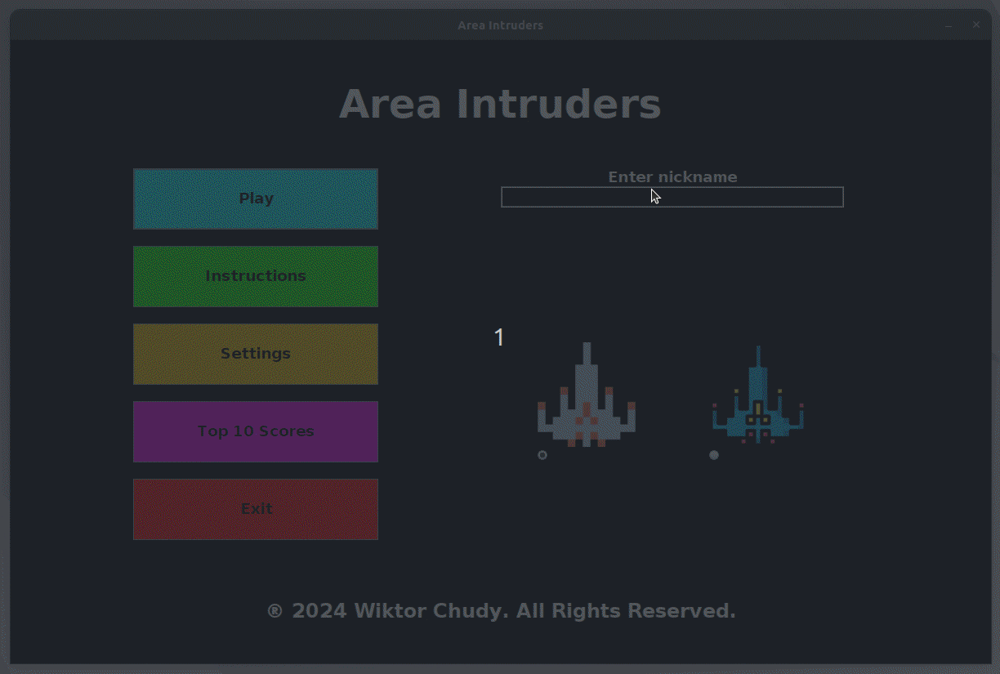

# 💻 Area Intruders

## 👀 About

Area Intruders is game based on classic and iconic Space Invaders - arcade game, in which player controls the ship trying to shoot down approaching enemies. Created with usage of Swing and AWT libraries, which provide powerful tools for building GUI and managing events within game.

## 🔧 Tech Stack

- Java (OOP, Multithreading, Streams, Lambdas)
- Swing
- AWT

## 💡 Features

- Main menu, in which user can enter nickname, choose ship appearance, display instructions, settings and top 10 scores.
- Player can control ship using arrow keys on the keyboard or special buttons in the window.
- Player can shoot using spacebar or special button in the window.
- Player can pause game.
- Player can end game at any time and be included in the top 10 results, if he has achieved the appropriate number of points.
- Player has a lot of setting options including: default difficulty levels (easy, normal, hard), game modes (normal, disco, mirror) and custom settings (enemy rows, enemy columns, enemy rows falling time). 
- Player earn points for hitting an enemy. Number of points depends on the selected difficulty level and game mode (possibly on player's custom settings).
- Scores are saved to the file, based on which the top 10 scores is prepared.
- Game offers the option of replaying game on previous settings after losing or finishing the game.

## 📺 Demo

## 🎮 Gameplay

